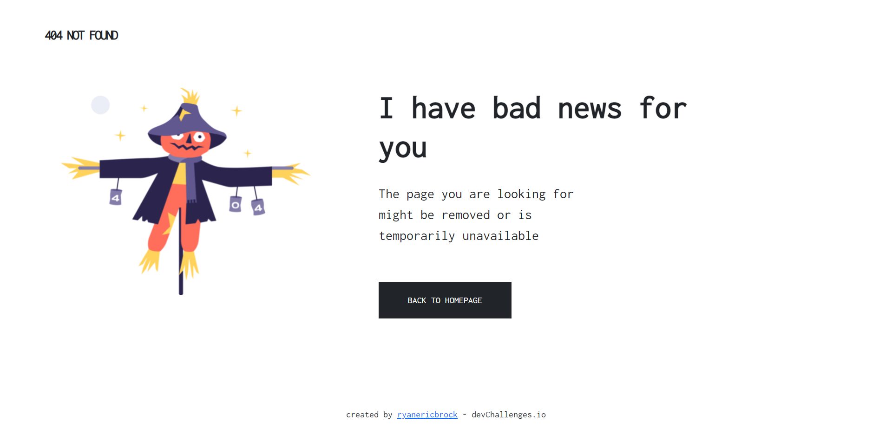
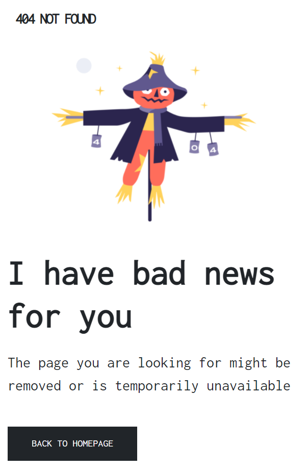

<h1 align="center">404 Not Found Challenge</h1>

   Solution for a challenge from  <a href="http://devchallenges.io" target="_blank">Devchallenges.io</a>.

  <h3>
    <a href="https://ryanericbrock.github.io/404-Not-Found-Challenge/">
      Demo
    </a>
     | 
    <a href="https://github.com/ryanericbrock/404-Not-Found-Challenge">
      Solution
    </a>
     | 
    <a href="https://devchallenges.io/challenges/wBunSb7FPrIepJZAg0sY">
      Challenge
    </a>
  </h3>

<!-- TABLE OF CONTENTS -->

## Table of Contents

- [Overview](#overview)
- [Built With](#built-with)
- [Features](#features)
- [Contact](#contact)
- [Acknowledgements](#acknowledgements)

<!-- OVERVIEW -->

## Overview

- My demo is viewable at <a href="https://ryanericbrock.github.io/404-Not-Found-Challenge/">Demo</a>
- This was a fantastic way to help solidify my knowledge of HTML, CSS, and Bootstrap.
- Using Bootstrap 5 and the media query to build a responsive website.
- If you have a paragraph that needs to be responsive, take advantage of media queries!

### Built With

- [Bootstrap 5](https://getbootstrap.com/docs/5.0/getting-started/introduction/)
- [Google Fonts](https://fonts.google.com/)

## Features

This application/site was created as a submission to a [DevChallenges](https://devchallenges.io/challenges) challenge. The [challenge](https://devchallenges.io/challenges/wBunSb7FPrIepJZAg0sY) was to build an application to complete the given user stories.

## Acknowledgements

- [Bootstrap Documentation](https://getbootstrap.com/docs/5.0/getting-started/introduction/)

## Contact

- Website [ryanericbrock](https://ryanericbrock.com)
- GitHub [@ryanericbrock](https://github.com/ryanericbrock)
- Twitter [@ryanericbrock](https://twitter.com/ryanericbrock)

# 404-Not-Found-Challenge
Solution to the 404 Not Found Challenge on devChallenges.io
>2f6b1a13cb5cc624cdf1b70adfc9c408843ac611
